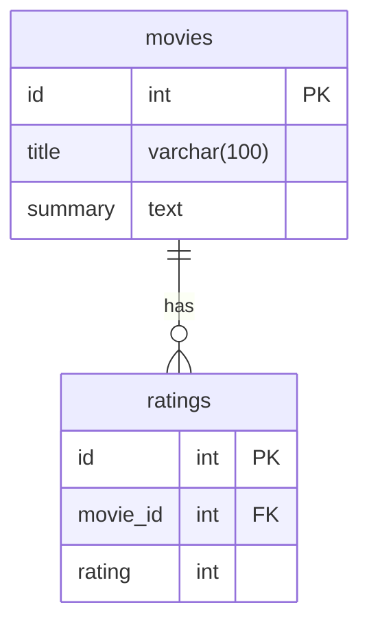

## Moview Review System

This is a simple movie review system that allows users to add, edit, delete and view movie reviews. The system also allows users to view the average rating of a movie.

## Building the project

### Building the project using dotnet core

To build the project, you need to have the following installed:

- dotnet core 3.1 or later

To build the project, run the following command:

```bash
dotnet build
```

### Building the project using Docker

To build the docker image, run the following command:

```bash
docker build -t movie-review-system .
```

## Running the project

### Running the project using dotnet core

To run the project, run the following command:

```bash
dotnet run --project MovieReviewSystem
```

### Running the project using Docker

To run the project using Docker, run the following command:

```bash
docker run -p 8080:80 movie-review-system
```

### Running the project using Docker Compose

To run the project using Docker Compose, run the following command from the `docker` directory:

```bash
docker compose up
```

If any changes are made to the project, you will need to rebuild the docker image before running the project using Docker Compose. To rebuild the docker image, run the following command:

```bash
docker compose up --build --force-recreate
```

## Database

The project uses PostgreSQL as the database. The database schema consists of the following tables:



## API Documentation

### Endpoints

The following endpoints are available:

| Endpoint                                 | Description                                      |
|------------------------------------------|--------------------------------------------------|
| `GET /movies`                            | Returns a list of all movies                     |
| `GET /movies?minRating={minRating}&maxRating={maxRating}` | Returns a list of movies with ratings between `minRating` and `maxRating`. Accepted values for `minRating` and `maxRating` are between `1` and `5` inclusive. |
| `GET /movies/{id}`                       | Returns a movie with the specified `id`          |
| `POST /movies`                           | Creates a new movie                              |
| `PUT /movies/{id}`                       | Updates a movie with the specified `id`          |
| `DELETE /movies/{id}`                    | Deletes a movie with the specified `id`          |
| `POST /movies/{id}/ratings`              | Adds a rating to a movie with the specified `id`. The rating should be between `1` and `5` inclusive. |


### Swagger

The API documentation can be found at the following URL:

```bash
http://localhost:8080/swagger/index.html
```
